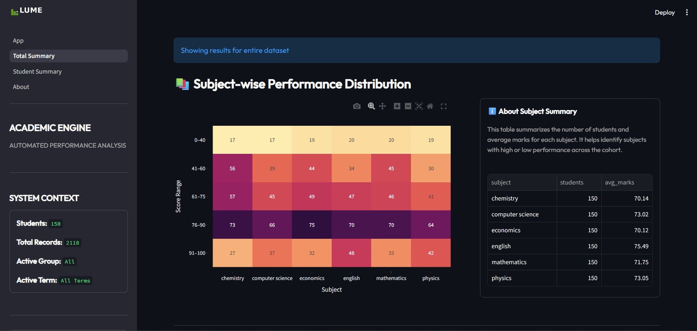
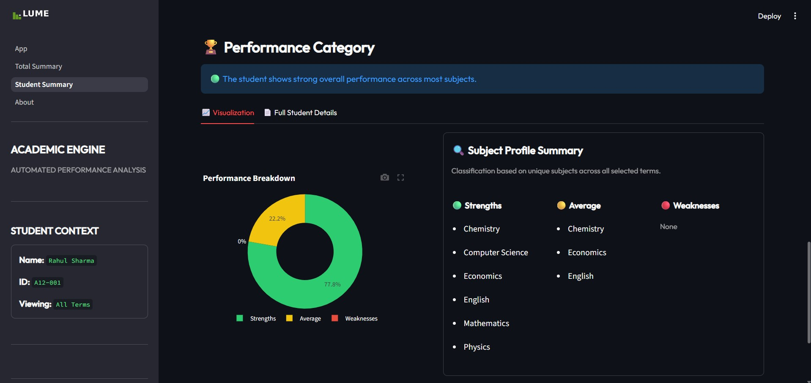
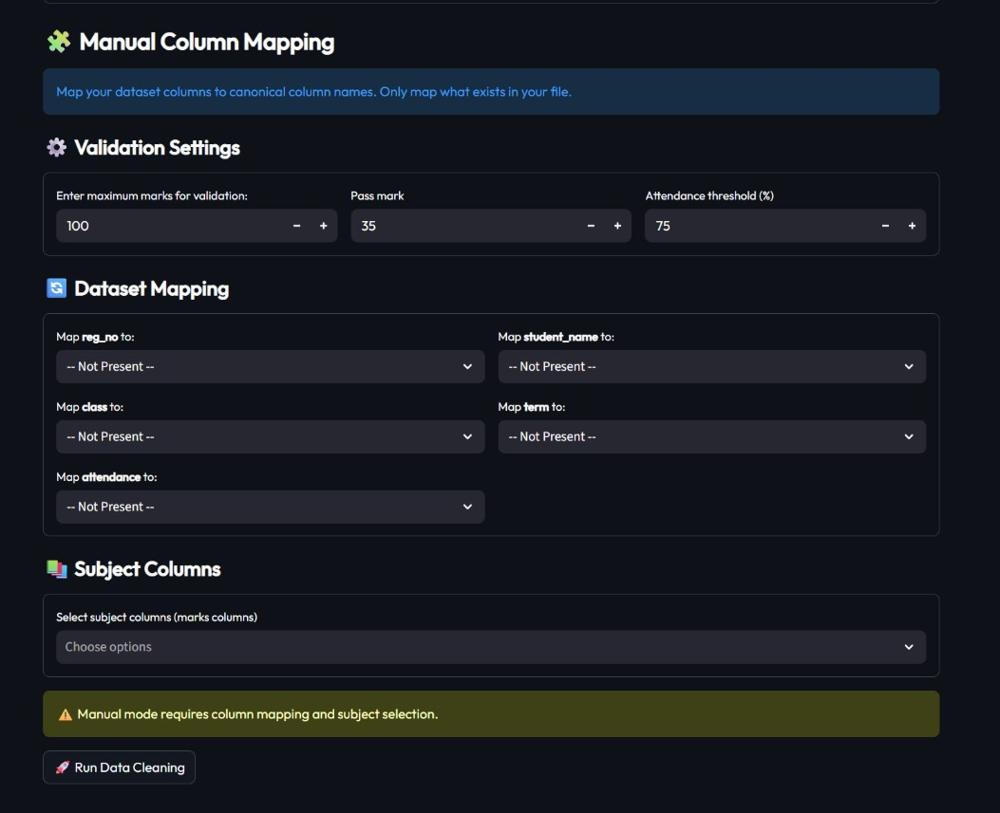
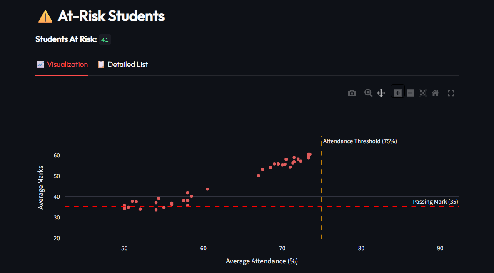

# LUME — Academic Intelligence Engine

> A modular, dark-themed academic analytics platform built with Python and Streamlit. LUME transforms messy, inconsistently formatted student spreadsheets into clean, actionable performance insights.

---

## Preview


| Total Summary | Student Summary |
|---|---|
|  |  |

---

## Overview

Educational institutions frequently store student records in spreadsheet format with varying column names, inconsistent attendance formats, embedded text inside numeric fields, and duplicate records. LUME addresses these challenges through an automated data cleaning pipeline and an interactive multi-page dashboard.

The system is modular in design, separating responsibilities into data loading, cleaning, analytics computation, visualization, and UI layers.

---

## Application Pages

### App — Data Upload & Cleaning

The entry point for uploading and processing student data. Supports CSV and Excel files. Includes an auto mode for standard datasets and a manual mapping mode for non-standard column structures with configurable validation thresholds.

### Total Summary — Cohort Analytics

Cohort-level overview including subject-wise performance heatmap, top ranked students, at-risk detection, and dynamic cohort filtering by class, term, or any available attribute.

### Student Summary — Individual Analytics

Per-student deep dive including subject-wise marks, marks distribution, performance categorization (strengths, average, weaknesses), and a full academic record view.

### About — System Documentation

Technical documentation covering system architecture, data requirements, processing logic, and navigation guide.

---

## System Architecture
```
Automated-student-performance-analysis/
├── App.py                      # Entry point — upload, clean, configure
├── pages/
│   ├── 01_Total_Summary.py     # Cohort-level dashboard
│   ├── 02_Student_Summary.py   # Individual student dashboard
│   └── About.py                # Technical documentation
├── src/
│   ├── analytics.py            # Aggregation, ranking, risk detection
│   ├── data_cleaning.py        # Preprocessing & validation pipeline
│   ├── schema.py               # Canonical schema & system constants
│   ├── ui_components.py        # Reusable UI component library
│   └── visualizations.py      # Plotly-based chart generation
├── data/
│   ├── raw/                    # Sample raw datasets
│   └── processed/              # Sample cleaned output
├── assets/                     # Logos, screenshots
└── .streamlit/
```

### Core Module Responsibilities

| Module | Responsibility |
|---|---|
| `App.py` | File upload, cleaning execution, session state management |
| `data_cleaning.py` | Full preprocessing pipeline — normalization, reshaping, validation |
| `analytics.py` | Student/subject summaries, ranking, at-risk detection |
| `visualizations.py` | All Plotly chart generation |
| `schema.py` | Canonical column names, aliases, and system constants |
| `ui_components.py` | Reusable `inject_font()`, `page_header()`, `section_header()`, `render_sidebar()` |

---

## Input Data Requirements

LUME accepts CSV (`.csv`) and Excel (`.xlsx`) files. The uploaded file must contain student-level data in wide format, where each row represents a student and each subject is a separate column.

A typical dataset structure:

| Reg No | Student Name | Class | Term | Attendance | Math | Physics | Chemistry |
|---|---|---|---|---|---|---|---|

Identification columns are auto-detected via alias matching. Subject columns are inferred automatically or selected manually.

---

## Data Cleaning Pipeline

The pipeline executes sequentially and is fully automated in auto mode.

### Column Normalization

Column names are standardized to lowercase and matched against an alias dictionary. Variations like "Roll No", "Registration Number", and "Roll Number" all map to the canonical `reg_no`. Manual mode allows explicit column mapping for non-standard datasets.

### Wide to Long Transformation

Subject columns are melted into a long-format structure where each row represents a single (student, subject) record, enabling consistent grouping, aggregation, and visualization.

### Marks Cleaning

Numeric values are extracted via regex. Entries like "78 marks" or "90/100" are cleaned to plain numbers. Marks outside the configured valid range are set to null and reported. The maximum marks threshold is configurable per session.

### Attendance Cleaning

Attendance is standardized to percentage format. Decimals (0.85 → 85%), percentage symbols (75% → 75), and invalid entries are all handled. Range validation enforces 0–100.

### Row Validation & Deduplication

Rows are dropped if registration number or subject is missing, or if both marks and attendance are null. Duplicate entries for the same (reg_no, subject, term) are detected and the first occurrence is kept.

### Conflict Detection

If the same registration number is linked to multiple student names, the pipeline raises a data integrity error before proceeding, prompting the user to fix the source file.

---

## Configurable Parameters



LUME supports runtime configuration of the following thresholds in manual mode:

| Parameter | Default | Description |
|---|---|---|
| Max Marks | 100 | Upper bound for valid mark entries |
| Pass Mark | 35 | Threshold below which a student is at-risk |
| Attendance Threshold | 75% | Minimum attendance to avoid at-risk classification |

These values are stored in session state and propagated across all pages without modifying `schema.py`.

---

## Analytical Features

### Subject-Level Summary
Average marks, average attendance, and unique student count per subject.

### Student-Level Summary
Average marks, average attendance, and total subjects taken per student.

### Ranking
Dense ranking based on average marks across all subjects a student has appeared in. Only students with marks in all subjects are ranked to ensure fairness. Multi-term datasets are fully supported.

### At-Risk Detection
A student is flagged as at-risk if their average marks fall below the pass mark threshold OR their average attendance falls below the attendance threshold. Both conditions are evaluated independently.



### Strength & Weakness Classification
Per student, subjects are classified as strengths (≥ 75), average (40–74), or weaknesses (< 40).

---

## UI Architecture

LUME uses a reusable component system via `src/ui_components.py`:

- `inject_font()` — Injects the Outfit font globally across all pages
- `page_header(label, title, subtitle)` — Renders consistent branded page headers
- `section_header(title)` — Renders uppercase section dividers
- `render_sidebar()` — Renders the dynamic sidebar with system context and student/cohort stats

The sidebar dynamically shows different context depending on the active page — cohort stats on Total Summary, individual student info on Student Summary.

---

## Assumptions & Known Limitations

- Marks are assumed to be numeric and percentage-based (out of a configurable max)
- Attendance is assumed to be uniform per student per term
- No support for letter grade systems (A/B/C) — conversion would need to be done before upload
- No multi-term longitudinal trend comparison across time
- No predictive modeling component
- Duplicate reg_no with different names raises a hard error rather than auto-resolving

---

## Technologies Used

- Python 3
- Pandas
- Streamlit
- Plotly
- OpenPyXL (Excel support)

---

## Running the Application
```bash
pip install -r requirements.txt
streamlit run App.py
```

The application opens in a browser. Upload a CSV or Excel file on the App page to begin.

A sample dataset is available in `data/raw/dummy_data.csv` and `data/raw/dummy_data.xlsx` for immediate testing.

---

## Academic Relevance

This project demonstrates applied knowledge in:

- Data cleaning and preprocessing pipelines
- Schema normalization and alias resolution
- Wide-to-long data reshaping (melt operations)
- Exploratory Data Analysis (EDA)
- Modular software architecture
- Session state management in multi-page Streamlit apps
- Dashboard-based reporting with Plotly
- Reusable UI component design

---

*LUME — Academic Intelligence Engine — v1.1.0*